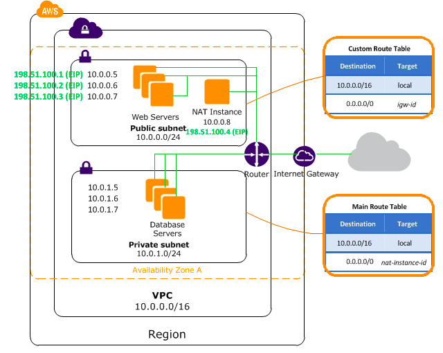

# Lab-sandbox-tf
A sandbox lab to practice IAC, terraform and AWS ec2 orchestration

# Current Lab Architecture

# Lab Goals

# Ec2 instances
- [x] AWS EC2 web instance
- [x] Second AWS EC2 private instance
- [x] VPC
- [x] EIP
- [x] Public and Private Subnet
- [x] NAT Gateway
- [x] Internet Gateway
- [x] Routing tables
- [x] VPC Security Groups
- [x] IAM Role
- [x] IAM Policy
- [x] IAM Instance Profile
- [x] Key Pair